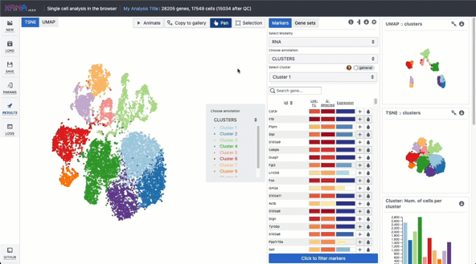
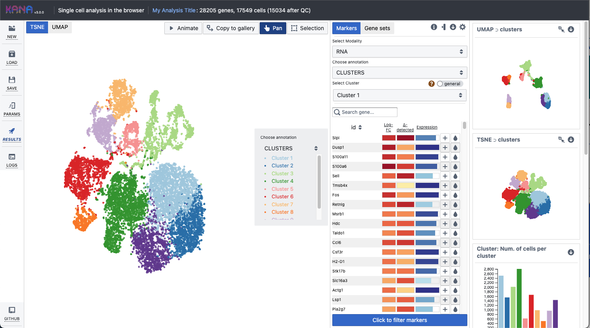
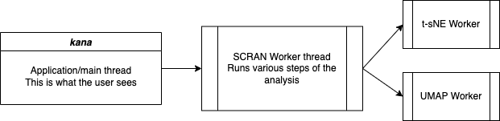
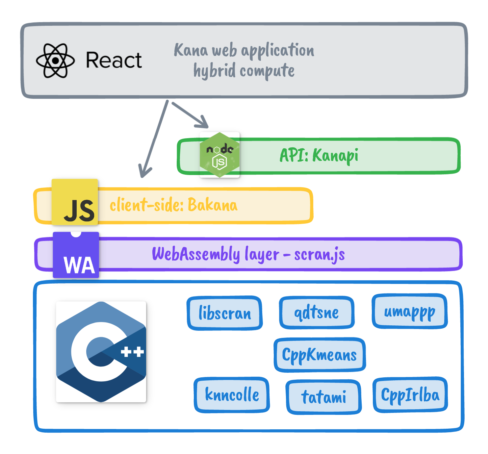

# AnnoC

**Single-cell RNA-seq analysis in the browser.** All computation runs on your machine via WebAssembly—no data is sent to a server.

[](https://doi.org/10.21105/joss.05603)
[](https://doi.org/10.1101/2022.03.02.482701)

---

## What is AnnoC?

AnnoC is a **client-side single-cell analysis web app**. QC, normalization, clustering, t-SNE/UMAP, marker detection, and cell-type annotation run entirely in the browser.

| Benefit | Description |
|--------|-------------|
| **Privacy** | Your data never leaves your computer. |
| **Low cost** | Deploy as a static site; no backend or cloud. |
| **Interactive** | Animated embeddings, marker tables, annotation workflows. |

**Supported inputs:** Matrix Market (`.mtx`), 10X HDF5, H5AD (AnnData), RDS (SummarizedExperiment / SingleCellExperiment), ExperimentHub IDs, and pre-computed results for exploration-only mode.



---

## Installation

**From source (developers / self-host):**

```bash
git clone https://github.com/seqyuan/annocluster.git
cd annocluster
npm install --legacy-peer-deps
npm run start
```

Runs at `http://localhost:3000`. For production, build and deploy (see [Deployment](#deployment)).

**As a dependency (if published to npm):**

```bash
npm install annoc
```

Use the `build` output or scripts from `package.json` as needed.

---

## Deployment

AnnoC is a **static web app**. Build once and serve over **HTTPS** (required for SharedArrayBuffer / WebAssembly threads).

**1. Build**

```bash
npm run build
```

Output is in the `build` folder.

**2. Serve over HTTPS**

| Option | Notes |
|--------|------|
| **GitHub Pages** | Push `build` to `gh-pages` or use Actions. See the project wiki for details. |
| **Netlify / Vercel** | Build: `npm run build`, publish: `build`. |
| **S3 / GCS / Nginx / Caddy** | Upload or serve the `build` directory with HTTPS. |

**Local test:** `npx serve -s build` or `python -m http.server 3000 -d build` (production needs HTTPS for full WASM support).

**3. Docker (no Node on host)**

```bash
docker build . -t kana
docker run -v "$(pwd)":/kana -t kana
```

Serve the generated `builds` directory. On macOS M1/M2: `docker build . -t kana --platform linux/arm64`.

---

## Using AnnoC

1. Open the app (or run locally after [Installation](#installation)).
2. Load your data: Matrix Market (optionally with `genes.tsv` / `features.tsv`), H5AD, 10X HDF5, RDS, or an ExperimentHub ID.
3. Click **Analyze** to run the standard pipeline.

The workflow follows [Orchestrating Single-Cell Analysis with Bioconductor (OSCA)](https://bioconductor.org/books/release/OSCA/):

- QC and cell filtering → normalization and log-transform → mean–variance trend → PCA on variable genes → graph-based clustering → t-SNE/UMAP
- Marker detection per cluster, gene set enrichment, cell-type annotation (with reference datasets)
- Multi-modal (CITE-seq, CRISPR), custom cell selections, batch correction (MNN), subset analysis

**Tutorials:** See the project wiki.



**Tips:** Click a cluster in the legend to highlight it; use the droplet icon in the marker table to color the embedding by gene expression; **Save** captures the current plot to Gallery; **Animate** shows t-SNE/UMAP iterations; **Export** saves an analysis file (`.kana` format) to resume later.

---

---

## Contributing

See [CONTRIBUTING.md](./CONTRIBUTING.md) for guidelines on issues and pull requests.

---

## Architecture

- **[scran.js](https://github.com/kanaverse/scran.js)** – C/C++ single-cell methods compiled to WebAssembly for fast client-side execution.
- **Web Workers** – All heavy computation runs in workers so the UI stays responsive; t-SNE and UMAP run in separate workers in parallel.
- **SharedArrayBuffer + HTTPS** – WASM is built with PThreads; the app uses a service worker to set COOP/COEP headers, so the site must be served over HTTPS.



The AnnoC UI is a wrapper around **[bakana](https://github.com/kanaverse/bakana)** (core workflow in browser and Node). Related projects: **[kanapi](https://github.com/kanaverse/kanapi)** (Node/WebSocket API), **[kana-formats](https://github.com/kanaverse/kana-formats)** (export format), **[kanaval](https://github.com/kanaverse/kanaval)** (validation).



---

This project was bootstrapped with [Create React App](https://github.com/facebook/create-react-app).
